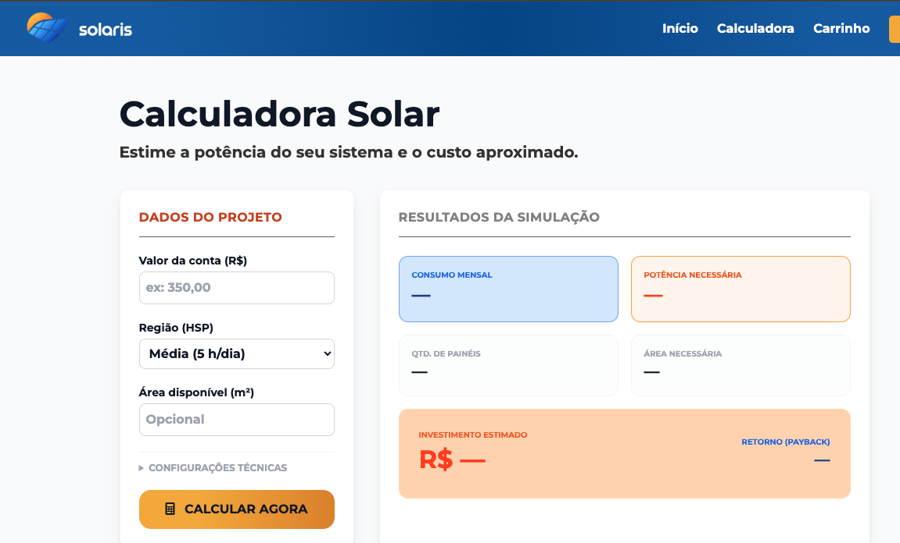
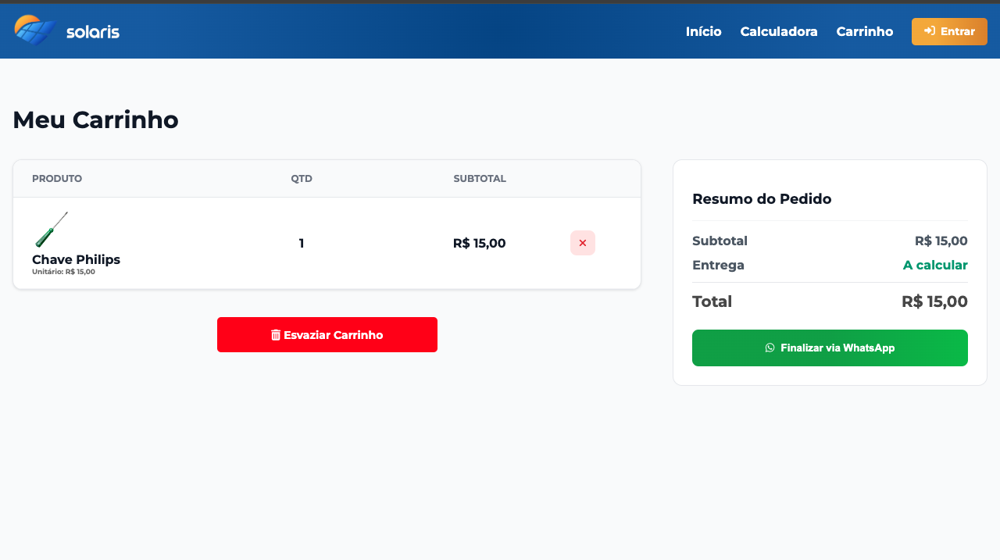

# Solaris • E-commerce de Energia Solar & Gestão Inteligente

## 🚀 Visão Geral do Projeto

O **Solaris** é uma aplicação web robusta para o setor de energia solar. Mais do que um simples e-commerce, o projeto integra um catálogo de produtos, uma calculadora de eficiência energética e um **Painel Administrativo completo** com autenticação e proteção de rotas, utilizando o ecossistema Firebase.

**🔗 Link do Projeto:** [https://solar-ecommerce-3992b.web.app/](https://solar-ecommerce-3992b.web.app/)

---

## 📸 Demonstração Visual

### 🏠 Home Page & Catálogo


### 📊 Calculadora Solar Inteligente
Ferramenta para estimativa de consumo, potência necessária e retorno sobre o investimento (Payback).


### 🛒 Carrinho & Checkout via WhatsApp
Fluxo de compra dinâmico com integração direta para fechamento de pedido via API do WhatsApp.


---

## 🛠️ Arquitetura Técnica e Diferenciais

A estrutura do projeto foi desenhada seguindo princípios de **modularidade** e **separação de responsabilidades**, o que facilita a manutenção e escalabilidade:

### 🔹 Front-end Modular (JavaScript ES6+)
*   **`auth.js` & `cadastrar.js`:** Gerenciamento completo de autenticação de usuários.
*   **`calculator.js`:** Lógica complexa para cálculo de economia e necessidade energética.
*   **`cart.js` & `ui.js`:** Manipulação dinâmica do DOM para uma experiência de usuário fluida.
*   **`guard.js`:** Implementação de Middlewares de segurança para proteger rotas administrativas.
*   **`gestao.js` & `orders.js`:** Módulos dedicados ao CRUD de produtos e controle de pedidos.

### 🔹 Backend & Integrações
*   **Firebase Ecosystem:** Uso de Firebase Auth para segurança e Hosting para deploy.
*   **`luvik-proxy-server`:** Implementação de um servidor proxy para lidar com integrações externas e segurança de dados.
*   **WhatsApp API:** Automação do fechamento de pedidos diretamente para o setor comercial.

---

## ✨ Funcionalidades em Destaque

| Funcionalidade | Descrição Técnica |
| :--- | :--- |
| **Calculadora Solar** | Algoritmo que processa dados de consumo para sugerir o kit ideal. |
| **Painel de Gestão** | Interface administrativa para controle total de estoque e preços. |
| **Sistema de Carrinho** | Persistência e gerenciamento de itens com cálculo de frete/total. |
| **Segurança (Guards)** | Proteção de páginas sensíveis, garantindo que apenas admins acessem a gestão. |

---

## 📂 Estrutura do Projeto (Real)

```text
SOLARIS/
├── assets/              # Recursos visuais e identidade da marca
│   ├── css/             # Estilização modular
│   └── js/              # Core Business Logic (app.js, auth.js, calculator.js, etc.)
├── luvik-proxy-server/  # Servidor proxy para integrações de API
├── public/              # Páginas HTML (index, admin, calculator, cart, etc.)
├── firebase.json        # Configurações de infraestrutura Firebase
└── package.json         # Gerenciamento de dependências e scripts
```

---

---

## 👨‍💻 Autor

**Nereu Correia de Souza Filho**  
[](https://www.linkedin.com/in/nereu-correia-de-souza-filho-9525a43a7/)  
[](mailto:seu.email@example.com)

---
*Este projeto demonstra competências em Desenvolvimento Full-Stack, Segurança de Aplicações, Integração de APIs e Cloud Hosting.*
